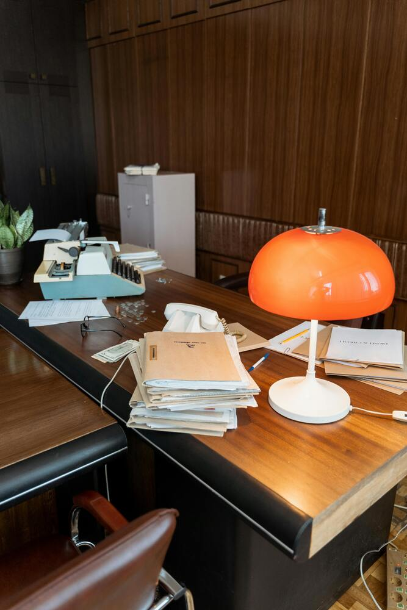

# Analyse Complète de la Codebase - Léa Starosse

**Date d'analyse** : 24 novembre 2025
**Dernière mise à jour** : 26 novembre 2025
**Site analysé** : https://leastarosse.github.io

---

## ✅ CORRECTIONS EFFECTUÉES

| Problème | Date | Détails |
|----------|------|---------|
| Sitemap incomplet | 24/11/2025 | Toutes les 7 pages ajoutées avec lastmod, changefreq, priority |
| robots.txt vide | 24/11/2025 | Configuré avec Allow et lien sitemap |
| Images `.off.jpg` inutilisées | 24/11/2025 | 12 fichiers supprimés (~18 MB économisés) |
| Images jamais utilisées | 24/11/2025 | 7 fichiers supprimés (~10 MB économisés) |
| Double footer dans Apropos.html | 26/11/2025 | Remplacé `<footer>` imbriqué par `<section>` et `<div>` |
| Liens YouTube morts | 26/11/2025 | Supprimés de tous les fichiers (7 pages x 2 occurrences) |
| `target="_blank "` avec espace | 26/11/2025 | Corrigé dans index.html, services.html, tarifs.html |
| Symbol SVG youtube inutilisé | 26/11/2025 | Supprimé de tous les fichiers HTML (7 pages) |
| Lazy loading sur logos | 26/11/2025 | Retiré des logos (above the fold) dans articles1/2.html |
| CSS mort dans style.css | 26/11/2025 | Supprimé datetime-container, accordion, blog-post (~100 lignes) |
| JS mort dans script.js | 26/11/2025 | Supprimé Chocolat, Isotope, Video Modal, sliders inutilisés (~70 lignes) |
| Fichier plugins.js | 26/11/2025 | Supprimé (Isotope, date-picker, Chocolat - ~30KB inutilisés) |
| Fichier vendor.css | 26/11/2025 | Supprimé (date-picker, Chocolat CSS - inutilisés) |
| Script Iconify | 26/11/2025 | Supprimé de toutes les pages (CDN jamais utilisé) |
| Balises HTML non fermées | 26/11/2025 | Ajout `</div>` manquant dans 5 fichiers (navigation header) |
| Meta tags articles1/2.html | 26/11/2025 | Corrigé title, og:title, og:description, og:url, og:type pour chaque article |
| Lazy loading images | 26/11/2025 | Vérifié : déjà OK (logos sans lazy car above the fold) |

**Gain total** : ~28 MB d'images + ~35KB de JS/CSS supprimés

---

## 1. DUPLICATIONS DE CODE (Problème Majeur)

### SVG Symbols (~100 lignes dupliquées x 7 pages)
Le bloc SVG avec tous les symbols (arrow-right, arrow-left, play, navbar-icon, location, phone, email, star, facebook, youtube, instagram, twitter, linkedin, etc.) est **copié-collé dans chaque fichier HTML** :
- `index.html:78-178`
- `services.html:68-168`
- `tarifs.html:69-169`
- `Apropos.html:76-176`
- `articles.html:70-170`

**Impact** : ~700 lignes de code dupliquées inutilement

### Header (~100 lignes dupliquées x 7 pages)
Le header complet avec :
- Barre d'info (location, téléphone, email)
- Liens réseaux sociaux
- Navigation principale

Est copié dans chaque fichier avec seulement la classe `active` qui change.

### Footer (~60 lignes dupliquées x 7 pages)
La section Contact/Footer est identique dans tous les fichiers.

### Scripts (~10 lignes x 7 pages)
```html
<script src="js/jquery-1.11.0.min.js"></script>
<script type="text/javascript" src="js/bootstrap.bundle.min.js"></script>
...
```

**Recommandation** : Utiliser des includes (PHP, SSI) ou un générateur de site statique (Jekyll, Hugo, 11ty).

---

## 2. PROBLÈMES SEO

### ~~Sitemap Incomplet~~ ✅ CORRIGÉ
~~Le sitemap ne contenait que la page d'accueil.~~
**Corrigé** : Toutes les 7 pages sont maintenant dans le sitemap avec métadonnées complètes.

### ~~Robots.txt Vide~~ ✅ CORRIGÉ
~~Le fichier était vide.~~
**Corrigé** : Configuré correctement.

### Balises Meta Incohérentes
| Page | Clarity | Trustpilot | og:url |
|------|---------|------------|--------|
| index.html | ✓ | ✓ | https://leastarosse.github.io |
| services.html | ✗ | ✗ | Correct |
| tarifs.html | ✗ | ✗ | Correct |
| Apropos.html | ✓ | ✗ | Incorrect (même que index) |

### Attributs Alt Dupliqués
Dans `services.html:298-333`, plusieurs images ont **deux attributs alt** :
```html

```
Le premier alt est ignoré, seul le second compte.

### ~~URLs Open Graph Incorrectes~~ ✅ CORRIGÉ
~~`Apropos.html:20` : `og:url` pointait vers la mauvaise URL.~~
**Corrigé** : L'URL pointe maintenant vers `https://leastarosse.github.io/Apropos.html`.

### Balise Charset Dupliquée
Dans `services.html`, `tarifs.html`, `articles.html` :
```html
<meta charset="UTF-8">
...
<meta charset="utf-8">
```

### ~~Lien YouTube Mort~~ ✅ CORRIGÉ
~~Tous les fichiers contenaient `<a href="#">` pour YouTube.~~
**Corrigé** : Liens YouTube supprimés de toutes les pages (header et footer).

---

## 3. CODE MORT / INUTILISÉ ✅ CORRIGÉ

### ~~CSS Inutilisé dans `style.css`~~ ✅ CORRIGÉ
~~Styles pour accordion, datetime-container, blog-post supprimés.~~

### ~~JavaScript Inutilisé dans `script.js`~~ ✅ CORRIGÉ
~~Video Modal, Isotope, Chocolat, sliders inutilisés supprimés.~~

### ~~Fichiers CSS/JS Inutiles~~ ✅ CORRIGÉ
- ~~`js/plugins.js`~~ - **Supprimé** (contenait Isotope, date-picker, Chocolat)
- ~~`css/vendor.css`~~ - **Supprimé** (styles pour date-picker et Chocolat)
- ~~`iconify-icon` CDN~~ - **Supprimé** de toutes les pages

### ~~Images `.off.jpg` Non Utilisées~~ ✅ SUPPRIMÉES
~~12 images "off" (~18 MB total) n'étaient référencées nulle part.~~
**Corrigé** : Tous les fichiers `.off.jpg` ont été supprimés.

### ~~Images Jamais Utilisées~~ ✅ SUPPRIMÉES
~~Plusieurs images n'étaient jamais utilisées.~~
**Corrigé** : `gestion.admin.jpg`, `gestion.locative.jpg`, `interlocuteurs.jpg`, `précomptabilité.jpg`, `bureau.jpg`, `logo.png`, `icon.ico` supprimés.

---

## 4. OPTIMISATION DES IMAGES (Partiellement Corrigé)

### ~~Taille Totale : ~46 MB~~ → ~5 MB (après nettoyage)

Les images inutilisées ont été supprimées. Images restantes à optimiser :

| Image | Taille | Recommandation |
|-------|--------|----------------|
| assistance admin.jpg | 1.4 MB | Réduire à <200 KB |
| archives.jpg | 1.3 MB | Réduire à <150 KB |
| bureau simple.jpg | 718 KB | Réduire à <100 KB |
| sablier.jpg | 532 KB | Acceptable |
| telephone.jpg | 362 KB | Acceptable |

**Recommandations restantes** :
1. ~~Supprimer les images inutilisées~~ ✅ FAIT
2. Convertir en WebP avec fallback JPEG
3. Redimensionner (max 1200px largeur pour web)
4. Compresser les images >500 KB

---

## 5. ERREURS HTML

### ~~Balises Non Fermées~~ ✅ CORRIGÉ
~~Dans tous les fichiers, la navigation a une structure cassée :~~
```html
<!-- CORRIGÉ : Ajout du </div> manquant pour fermer le div.d-flex -->
```
**Corrigé** : Ajout du `</div>` manquant dans 5 fichiers (index.html, services.html, tarifs.html, Apropos.html, articles.html)

### ~~Balise `<li>` Non Fermée~~ ✅ VÉRIFIÉ
~~Dans les sections Contact de tous les fichiers~~
**Vérifié** : Les balises `<li>` sont correctement fermées dans tous les fichiers.

### ~~Footer Imbriqué dans Footer (`Apropos.html`)~~ ✅ CORRIGÉ
~~Double `<footer>` imbriqué.~~
**Corrigé** : Remplacé par `<section id="Contact">` avec `<div class="row">`.

### Commentaire Mal Placé dans `services.html:169-172`
```html
<!--
<div class="preloader">
  <div class="loader"></div>
</div> -->
```

---

## 6. ACCESSIBILITÉ

### Problèmes Identifiés
- ~~**Liens vides** : `<a href="#">` pour YouTube sans texte descriptif~~ ✅ CORRIGÉ
- **Images sans alt significatif** : certains alt sont vides ou génériques
- **Contraste** : couleur primaire `#F86295` sur fond clair peut poser problème
- **Navigation clavier** : structure HTML cassée peut affecter la navigation
- ~~**Attribut `target="_blank "` avec espace**~~ ✅ CORRIGÉ

---

## 7. PERFORMANCES

### Problèmes
1. **jQuery 1.11.0** (2014) - version très ancienne, vulnérabilités connues
2. **6 fichiers JS externes** chargés en séquence
3. **Pas de lazy loading** sur les images
4. **Pas de minification** du CSS/JS custom
5. **CDN multiples** (jsdelivr, unpkg, googleapis) - latence
6. **Images non optimisées** (~46 MB total)

### Recommandations Prioritaires
1. Mettre à jour jQuery vers v3.x ou supprimer si possible
2. Bundler et minifier CSS/JS
3. Ajouter `loading="lazy"` aux images
4. Utiliser un seul CDN ou self-host
5. Optimiser/supprimer images inutiles

---

## RÉSUMÉ DES PRIORITÉS

| Priorité | Problème | Impact | Statut |
|----------|----------|--------|--------|
| ~~🔴 Critique~~ | ~~Images non optimisées (46 MB)~~ | ~~Performance, SEO~~ | ✅ Partiellement corrigé (~5 MB restants) |
| 🔴 Critique | Code dupliqué (~2000 lignes) | Maintenance | ⏳ À faire (long terme) |
| ~~🟠 Important~~ | ~~Sitemap incomplet~~ | ~~SEO~~ | ✅ Corrigé |
| ~~🟠 Important~~ | ~~Robots.txt vide~~ | ~~SEO~~ | ✅ Corrigé |
| ~~🟠 Important~~ | ~~HTML invalide (balises non fermées)~~ | ~~Accessibilité~~ | ✅ Corrigé |
| ~~🟡 Moyen~~ | ~~Code JS/CSS mort~~ | ~~Performance~~ | ✅ Corrigé |
| 🟡 Moyen | jQuery obsolète | Sécurité | ⏳ À faire (long terme) |
| ~~🟢 Mineur~~ | ~~Attributs alt dupliqués~~ | ~~SEO~~ | ✅ Vérifié (déjà OK) |
| ~~🟢 Mineur~~ | ~~Meta incohérentes entre pages~~ | ~~SEO~~ | ✅ Corrigé |

---

## ACTIONS RECOMMANDÉES

### Court terme (Quick wins)
1. ~~Compléter le sitemap.xml avec toutes les pages~~ ✅
2. ~~Configurer robots.txt~~ ✅
3. ~~Supprimer les images inutilisées (~25 MB)~~ ✅
4. ~~Corriger les balises HTML non fermées~~ ✅
5. ~~Supprimer les liens YouTube morts ou ajouter un vrai lien~~ ✅

### Moyen terme
1. Optimiser et compresser les images restantes
2. ~~Ajouter `loading="lazy"` aux images~~ ✅ (déjà OK, logos exclus car above the fold)
3. ~~Corriger les attributs alt dupliqués~~ ✅ (déjà OK)
4. ~~Harmoniser les meta tags entre les pages~~ ✅
5. ~~Nettoyer le CSS/JS inutilisé~~ ✅

### Long terme
1. Migrer vers un générateur de site statique (Jekyll, Hugo, 11ty)
2. Mettre à jour jQuery ou migrer vers vanilla JS
3. Mettre en place un build system (bundling, minification)
4. Convertir les images en WebP
5. Auditer l'accessibilité complète (WCAG)